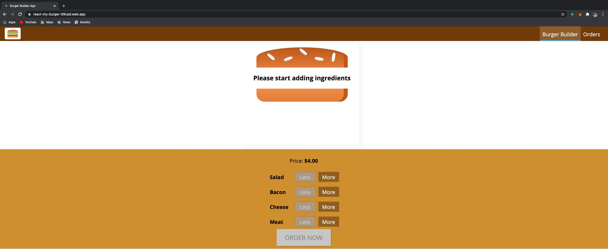

## Burger Ordering Application w/ ReactJS
A burger ordering application made using React JS which enables users to make a personalised burger of their liking and lets them place the order.
##
</img>
##

### What I used? 🤔

- React 16 / Jsx pages
- React Router
- Axios
- Webpack
- Babel
- Vanilla JavaScript
- HTML5
- CSS3 w/ Mobile First approach
- FireBase for Database and Hosting

## How to setup Start? ⚙️

<pre>npm install</pre>
then
<pre>npm start</pre>

## Deployment 🚀

<a href="https://burger-order-app.vercel.app/">Link</a>

<pre>npm install</pre>
then
<pre>npm start</pre>

#### License

MIT License